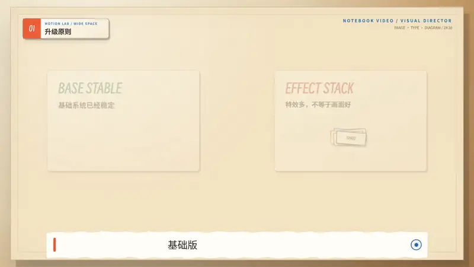

# Notebook Video

[English](README.md) | [简体中文](README.zh-CN.md)

[](https://github.com/hyt315/notebook-video/actions/workflows/validate.yml)
[](https://github.com/hyt315/notebook-video/releases/latest)
[](https://github.com/hyt315/notebook-video/releases)
[](CONTRIBUTORS.md)
[](LICENSE)

Turn a Chinese explainer or promotional script into a reproducible 2K notebook-style video. Choose image-plus-text, pure-text or pure-graphic scenes from meaning, then combine original support art, semantic captions, deterministic motion, cross-platform rendering and automated QA in one workflow.

[Download latest release](https://github.com/hyt315/notebook-video/releases/latest) · [Install as an Agent Skill](#install-as-an-agent-skill) · [See the 30-second demo](assets/demo/notebook-video-demo.mp4)

[](assets/demo/notebook-video-demo.mp4)

> This preview is rendered from the repository's official Remotion project. It is not a concept image. The linked MP4 is silent so the public repository does not redistribute third-party narration.

## Why use it

- **One production contract:** script, storyboard, TTS timing, semantic captions, motion, render and QA stay in one workflow.
- **A visual director, not a scene template:** concrete subjects use image plus text, verbal contrast uses pure typography, and processes use native graphics instead of repeating card slides.
- **Pluggable image generation:** Codex can use its built-in image capability; other agents can use an equivalent tool, user assets, licensed assets or native SVG without platform lock-in.
- **Images participate in the explanation:** the bitmap supplies subject and atmosphere while Remotion owns exact callouts, arrows, text, diagrams, timing and exits.
- **Reproducible visuals:** the 2560×1440 warm-ivory notebook system is code, not a style prompt an AI must reinterpret.
- **Readable Chinese captions:** line breaks follow meaning and pauses; protected names, numbers and units stay together.
- **Honest retention hooks:** show a sourced payoff or tension within 1.5 seconds, open a question by 8 seconds, and resolve it later with evidence.
- **Editable delivery:** every run can produce H.264/AAC video, QA evidence and the complete Remotion source project.
- **Cross-platform tooling:** macOS, Windows and Linux use the same Node launcher; shell and `.cmd` files are optional wrappers.

## Install as an Agent Skill

Install the complete repository; `SKILL.md` depends on `scripts/`, `references/` and `assets/`.

| Agent | User-level install | Invoke |
| --- | --- | --- |
| Codex | `git clone https://github.com/hyt315/notebook-video.git ~/.agents/skills/notebook-video` | Ask Codex to use `$notebook-video`, or select it with `/skills` |
| Claude Code | `git clone https://github.com/hyt315/notebook-video.git ~/.claude/skills/notebook-video` | Ask Claude Code to use the `notebook-video` skill |
| Cursor | `git clone https://github.com/hyt315/notebook-video.git ~/.cursor/skills/notebook-video` | Ask Cursor Agent to use the `notebook-video` skill |

For repository-scoped installation, clone into `.agents/skills/notebook-video`, `.claude/skills/notebook-video`, or `.cursor/skills/notebook-video` inside that repository. Refresh the skills page or open a new session if a newly installed skill is not yet detected.

Windows PowerShell example:

```powershell
git clone https://github.com/hyt315/notebook-video.git "$HOME\.agents\skills\notebook-video"
```

You can also give a coding agent this request:

```text
Install the Agent Skill from https://github.com/hyt315/notebook-video.
Keep the whole repository together, verify SKILL.md, and run its built-in validation.
```

## Download

Choose whichever method matches your workflow:

```bash
# HTTPS
git clone https://github.com/hyt315/notebook-video.git

# SSH
git clone git@github.com:hyt315/notebook-video.git

# GitHub CLI
gh repo clone hyt315/notebook-video

# Branch ZIP
curl -L https://github.com/hyt315/notebook-video/archive/refs/heads/main.zip -o notebook-video-main.zip

# Inspect only the raw skill contract (not a complete installation)
curl -L https://raw.githubusercontent.com/hyt315/notebook-video/main/SKILL.md -o SKILL.md
```

Browser downloads: [latest release](https://github.com/hyt315/notebook-video/releases/latest) · [main branch ZIP](https://github.com/hyt315/notebook-video/archive/refs/heads/main.zip)

## Five-minute example

After cloning, validate the skill and create an editable project:

```bash
node scripts/notebook-video.mjs check-deps
node scripts/notebook-video.mjs validate-skill
node scripts/notebook-video.mjs new-project ./my-video
node scripts/notebook-video.mjs prepare-browser ./my-video
```

Edit `my-video/narration.txt`, `storyboard.md`, `manifests/semantic-caption-lines.txt` and the scene objects. Assign `image-text`, `pure-text` or `pure-graphic` to every scene. Put used rasters in `public/illustrations/` and register them in `manifests/visual-assets.json`. Supply provider-neutral `audio/narration.mp3` and word timing JSON, then build captions, render and verify:

```bash
node scripts/notebook-video.mjs build-semantic-captions ./my-video/audio/narration.mp3.json ./my-video/manifests/semantic-caption-lines.txt ./my-video/manifests/caption-cues.json --lead-ms 60
node scripts/notebook-video.mjs validate-visual-plan ./my-video
node scripts/notebook-video.mjs render ./my-video ./my-video/renders/final.mp4
node scripts/notebook-video.mjs validate-video ./my-video/renders/final.mp4 EXPECTED_SECONDS ./my-video/renders/contact-sheet.jpg
```

`prepare-browser` and `render` install the pinned npm dependencies when needed. Windows users run the same Node commands in Command Prompt or PowerShell. In restricted containers where Remotion cannot enumerate network interfaces, prefix render commands with `REMOTION_USE_NETWORK_SHIM=1`.

## Requirements

- Node.js 20 or later
- Python 3.9 or later
- FFmpeg and FFprobe available on `PATH`
- A compatible Remotion/Chrome rendering environment
- An image-generation tool is optional; user assets, licensed assets and native SVG/Remotion graphics are supported fallbacks

No credentials or API keys are included. The repository stores dependency manifests, not installed dependencies. `node_modules`, the rendering browser, external TTS tools, caches and rendered videos are created locally and excluded from source packages. Bundled fonts and small procedural sound effects are intentional deterministic assets with license notices. See [DEPENDENCIES.md](DEPENDENCIES.md).

## Repository map

- `SKILL.md` — agent operating contract and enforced workflow.
- `assets/example-project/` — official runnable Remotion engine.
- `assets/demo/` — outputs rendered from that engine for public evaluation.
- `scripts/` — cross-platform project, caption, render, package and QA tools.
- `references/` — visual-director, image-generation, timing, hook, performance and compatibility contracts.
- `assets/fonts/` — bundled fonts and original license notices.

## Validate a change

```bash
node scripts/notebook-video.mjs validate-skill
node scripts/notebook-video.mjs validate-official-example
node scripts/notebook-video.mjs validate-visual-plan assets/example-project
```

For visual or timing changes, also render the affected range, inspect the required keyframes and run the video/caption checks in `SKILL.md`. Do not change the locked visual system or renderer without rendered evidence.

## Licensing and third-party materials

The project code and skill content are Apache-2.0. Source Han Sans and Smiley Sans remain under SIL OFL 1.1. Bundled sound effects are procedurally generated and documented in the example project. The official image-plus-text exemplar uses an image generated with OpenAI image generation at the user's request; source, purpose, crop and rights notes are recorded in `visual-assets.json`. Remotion is source-available under the Remotion License rather than an OSI-approved open-source license; some organizations may require a paid license. TTS and image providers are replaceable, and no provider client or credential is bundled.

See [NOTICE](NOTICE), [DEPENDENCIES.md](DEPENDENCIES.md) and the generated project's Remotion notice before commercial use.

## Contributing and security

This project is built by [hyt315](https://github.com/hyt315) with ChatGPT in Codex mode. See [CONTRIBUTORS.md](CONTRIBUTORS.md) for roles and attribution.

Read [CONTRIBUTING.md](CONTRIBUTING.md), [CODE_OF_CONDUCT.md](CODE_OF_CONDUCT.md) and [CHANGELOG.md](CHANGELOG.md). Report vulnerabilities through [GitHub Private Vulnerability Reporting](SECURITY.md), not a public issue.
